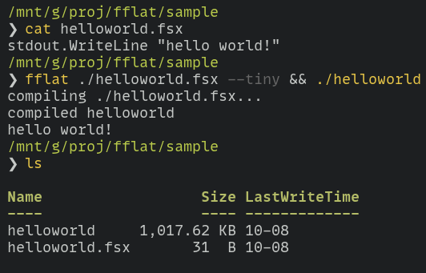

# fflat - F# native script compiler on [bflat](https://flattened.net/)


## Build 1MB native executables from .fsx scripts!




## Installation

```
dotnet tool install --global fflat
```

## Basic usage

```bash
fflat script.fsx            # about 13MB, full .NET
fflat script.fsx --small    # about 2.6MB, no debug/globalization/symbols
fflat script.fsx --tiny     # about 1MB, no reflection/exceptions, no printfn!
```

run `fflat --help` for a list of options

## Advanced usage

```bash
fflat ./helloworld.fsx --small build -x -r "mylibrary.dll" --os windows ## ... etc
```

using fflat to as an interface to the F# compiler
```bash
fflat ./mylibrary.fsx build-il --watch ## quickly recompiles mylibrary.dll on every change 
```

#### all options

```bash
❯ fflat ./helloworld.fsx build --help
Usage:
  fflat <script> [fflat options] build|build-il [<>...] [bflat options]

fflat options:
    -t, --tiny                            Smallest possible executable (adds bflat args
                                          --no-reflection --no-globalization --no-stacktrace-data
                                          --no-exception-messages --no-debug-info
                                          --separate-symbols -Os). avoid using printfn!
    -s, --small                           small executable but retains reflection, stack trace
                                          and exception messages (adds bflat args --no-debug-info
                                          --no-globalization --separate-symbols -Os)
    --output, -o <outputFile>             output executable path

bflat options:
  -d, --define <define>                    Define conditional compilation symbol(s)
  -r, --reference <file list>              Additional .NET assemblies to include
  --target <Exe|Shared|WinExe>             Build target
  -o, --out <file>                         Output file path
  -c                                       Produce object file, but don't run linker
  --ldflags <ldflags>                      Arguments to pass to the linker
  -x                                       Print the commands
  --arch <x64|arm64>                       Target architecture
  --os <linux|windows|uefi>                Target operating system
  --libc <libc>                            Target libc (Windows: shcrt|none, Linux: glibc|bionic)
  -Os, --optimize-space                    Favor code space when optimizing
  -Ot, --optimize-time                     Favor code speed when optimizing
  -O0, --no-optimization                   Disable optimizations
  --no-reflection                          Disable support for reflection
  --no-stacktrace-data                     Disable support for textual stack traces
  --no-globalization                       Disable support for globalization (use invariant mode)
  --no-exception-messages                  Disable exception messages
  --no-pie                                 Do not generate position independent executable
  --separate-symbols                       Separate debugging symbols (Linux)
  --no-debug-info                          Disable generation of debug information
  --map <file>                             Generate an object map file
  -i <library|library!function>            Bind to entrypoint statically
  --feature <Feature=[true|false]>         Set feature switch value
  -res <<file>[,<name>[,public|private]]>  Managed resource to include
  --stdlib <DotNet|None|Zero>              C# standard library to use
  --deterministic                          Produce deterministic outputs including timestamps
  --verbose                                Enable verbose logging
  --langversion <langversion>              C# language version ('latest', 'default', 'latestmajor',
                                           'preview', or version like '6' or '7.1'
  -?, -h, --help                           Show help and usage information
```

## Common questions, troubleshooting


> Why?

there is almost a 1000x difference in startup time for dotnet fsi scripts using nuget!


there is also [FSharpPacker](https://github.com/kant2002/FSharpPacker/tree/main) for .fsx scripts, which compiles .fsx scripts to native executables using the standard MSBuild pipeline (PublishAOT), but [bflat](https://flattened.net/) can produce significantly smaller executables or even omit the .NET runtime/GC all together.


> `TypeInitialization_Type_NoTypeAvailable` errors

use `--small` instead of `--tiny`, --tiny will crash if your script uses any 
reflection features.

there's many untrimmable features in the F# core library like printfn, quotations and linq.
substituting all printfn calls with stdout.WriteLine will produce significantly
smaller binaries as well.


---

Have fun!

