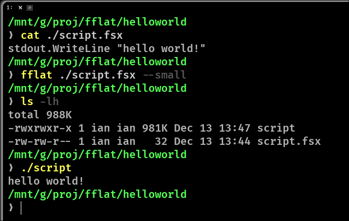
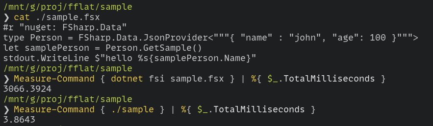

# fflat - F# native script compiler on [bflat](https://flattened.net/)


## Build 1MB native executables from .fsx scripts!




## Installation

```
# install the dependencies (on a debian-based system)
apt install -y libc++-dev
# install the global tool
dotnet tool install --global fflat
```

see `./Dockerfile` for a self-contained example

## Basic usage

```bash
fflat script.fsx             # about 1.4M, no debug/globalization/symbols
fflat script.fsx --small     # about 1MB, no reflection/exceptions, no printfn!
```

run `fflat --help` for a list of options

## Advanced usage

arm64 executable
```bash
fflat script.fsx --arch arm64 # 1.4MB and runs on raspberry pi! 👍
```

using fflat to as an interface to the F# compiler
```bash
fflat ./mylibrary.fsx build-il --watch ## quickly recompiles mylibrary.dll on every change 
```

```bash
fflat ./helloworld.fsx --small --os windows ## ... etc
```

## Shared library (experimental)

```bash
fflat script.fsx [--small] build-shared
```

#### all options

```bash
MAIN:

    <script>              .fsx script file path (first argument)

SUBCOMMANDS:

    build <options>       compile to native with bflat [default]
    build-il <options>    compile to IL (using fsc)
    build-shared <options>
                          compile to shared library

    Use 'fflat <subcommand> --help' for additional information.

OPTIONS:

    --verbose, -v         verbose output
    --version             version of application
    --ldflags <string>    <ldflags>
    --noreflection        disable reflection
    --arch <unknown|arm|arm64|x64|x86|wasm32|loongarch64>
                          <x64|arm64>
    --os <unknown|windows|linux|uefi>
                          <linux|windows|uefi>
    --optimize <none|prefersize|blended|preferspeed>
                          <preferspeed|prefersize>
    --tiny, -t            smallest possible executable. NB! avoid using printfn with this
    --small, -s           small executable but retains reflection, stack trace and exception
                          messages
    --output, -o <outputFile>
                          output executable path
    --help                display this list of options.
```

## Common questions, troubleshooting


> Why?

there is almost a 1000x difference in startup time for dotnet fsi scripts using nuget!



there is also [FSharpPacker](https://github.com/kant2002/FSharpPacker/tree/main) for .fsx scripts, which compiles .fsx scripts to native executables using the standard MSBuild pipeline (PublishAOT), but [bflat](https://flattened.net/) can produce significantly smaller executables or even omit the .NET runtime/GC all together.


> `TypeInitialization_Type_NoTypeAvailable` errors

use `--small` instead of `--tiny`, --tiny will crash if your script uses any 
reflection features.

there's many untrimmable features in the F# core library like printfn, quotations and linq.
substituting all printfn calls with stdout.WriteLine will produce significantly
smaller binaries as well.


---

Have fun!

